<!--
machine: Policy
platform: VulNyx
author: d4t4s3c
difficulty: Easy
os: Windows
ip: 10.10.2.5

skills:
- Directory Fuzzing
- Encrypted Archive Cracking
- Group Policy Preferences (GPP) Abuse  
- WinRM Authentication
- Remote Command Execution (RCE)
- Environment Variable Enumeration  
- Credential Reuse  
-->

<div align="center">

# Policy - VulNyx
**Información General**
  
|  |  |
|---|---|
| **Máquina** | Policy |
| **Plataforma** | [VulNyx](https://vulnyx.com/) |
| **Autor** | d4t4s3c |
| **Dificultad** | `Easy` |
| **Sistema Operativo** | `Windows` |
| **IP** | `10.10.2.5` |
|  |  |

</div>

>**Skills:**
> - Directory Fuzzing
> - Encrypted Archive Cracking
> - Group Policy Preferences (GPP) Abuse  
> - WinRM Authentication -> Remote Command Execution (RCE)
> - Environment Variable Enumeration  
> - Credential Reuse  

**Etapas:**
- [Reconocimiento](#reconocimiento)
- [Enumeracion Web](#enumeracion-web)
- [Cracking de Archivo Comprimido](#cracking-de-archivo-comprimido)
- [Abuso de Group Policy Preferences](#abuso-de-group-policy-preferences)
- [Acceso a Shell via WinRM](#acceso-a-shell-via-winrm)
- [Escalada de Privilegios](#escalada-de-privilegios)

## Reconocimiento

Primeramente, comenzamos identificando a la maquina objetivo dentro de nuestra red virtual con ayuda de `nmap`.
```bash
nmap -sn 10.10.2.0/24
```

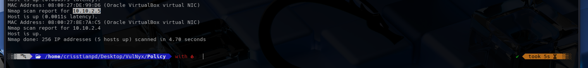

Una vez identificada la ip objetivo que en este caso es la `10.10.2.5`, procedemos a escanear rapidamente los 36,535 puertos de dicha maquina en busca de los que esten especialmente abiertos.
```bash 
nmap -p- -sS --open --min-rate 5000 -vvv -n -Pn 10.10.2.5 -oG openPorts
```

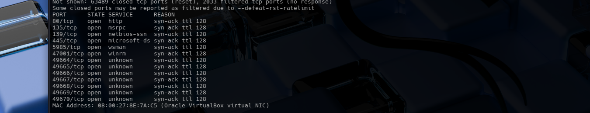

Ahora escaneamos cada uno de los puertos abiertos para determinar servicios y versiones.
```bash
nmap -p80,135,139,445,5985,47001,49664,49665,49666,49667,49668,49669,49670 -sCV 10.10.2.5 -oN targeted
```

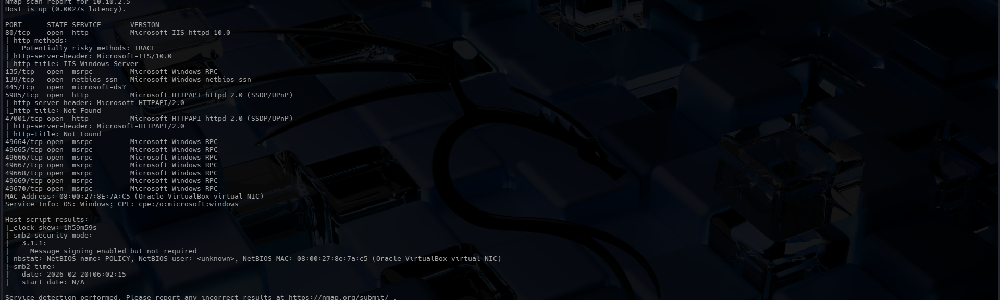

Segun los resultados obtenidos, podemos deducir que estamos ante una maquina windows. Posee el puerto 80 abierto bajo el servicio *Internet Information Services (`IIS`) 10.0*, posee el servicio *Server Message Block(`SMB`)* activo y *Remote Procedure Call(`RPC`)* dinamico.

Hay mas detalles en el escaneo pero las iremos desglosando con forme sea necesario.

## Enumeracion Web

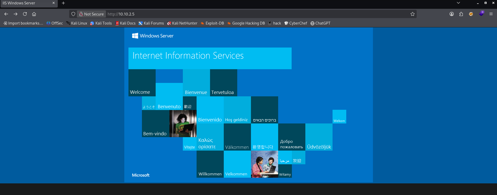

En la pagina web no vemos algo interesante de primeras, por lo que procederemos a hacer fuzzing con ayuda de `gobuster`.
```bash
gobuster dir -u 10.10.2.5 -w /usr/share/wordlists/dirbuster/directory-list-2.3-medium.txt -t 200 -x txt,php,asp,aspx,bat,html,zip,xml,config
```

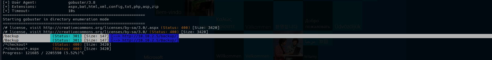

`gobuster` identifica un directorio de nombre `/backup/`, por lo que procederemos a hacer fuzzing sobre este en busca de archivo con posible acceso mal configurado.
```bash
gobuster dir -u 10.10.2.5/backup/ -w /usr/share/wordlists/dirbuster/directory-list-2.3-medium.txt -t 200 -x txt,php,asp,aspx,bat,html,zip,xml,config
```


¡Bingo!. Existe un archivo de nombre `groups.zip` por lo que lo descargamos para su posterior analisis.
```bash
curl -O http://10.10.2.5/backup/groups.zip > groups.zip
```

El comprimido al parecer se encuentra cifrado ¿Que hacemos ahora?

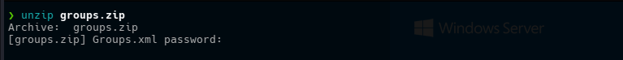

## Cracking de Archivo Comprimido

Extraemos el hash con `zip2john`.

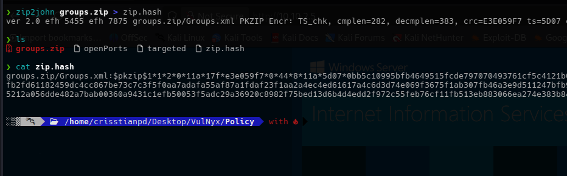

Ahora procedemos a crackear el hash con `john` utilizando el diccionario `rockyou`.
```bash
john -wordlist=/usr/share/wordlists/rockyou.txt zip.hash
```

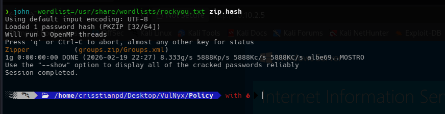

Una vez con la contraseña obtenida, podemos proceder a descomprimir el `groups.zip` y asi tener acceso al archivo `Groups.xml`.

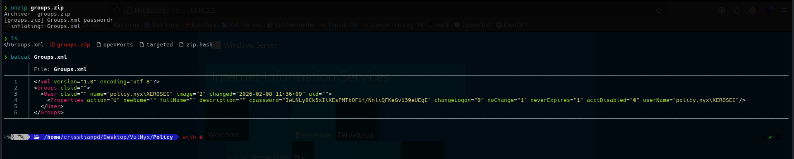

## Abuso de Group Policy Preferences

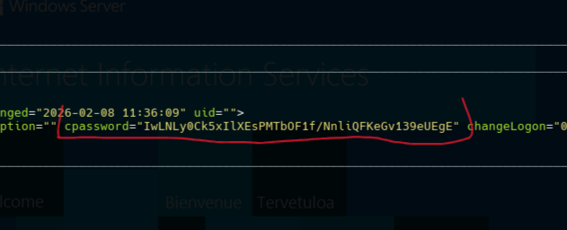

Si observamos la estructura del archivo *.xml*, junto con el campo `cpassword` que contiene lo que parece ser una contraseña, todo apunta a que es un archivo generado por Group Policy Preferences (GPP). ¿Policy? Es una pista supongo.

El problema es que las contraseñas que son *"encriptadas"* por `GPP`, poseen un cifrado *AES* estatico, porende, estas claves se pueden desencriptar utilizando la misma clave *AES* que ya se conoce y que es publica, y que de hecho, fue publicada por Microsoft en su momento.

Asi que, con `gpp-decrypt` vamos a extraer la contraseña en texto plano.

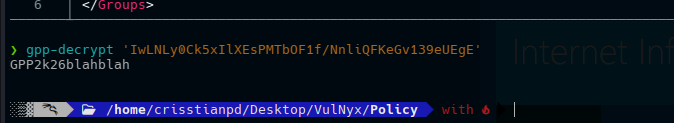

Esta contraseña sera la que probaremos junto con el usuario `XEROSEC` que tambien estaba presente en el archivo `Groups.xml`.

## Acceso a Shell via WinRM

Si volvemos a obervar el reporte de `nmap`, podemos observar que el servicio `winrm` esta activo en la maquina. Esto lo deducimos ya que el puerto correspondiente a dicho servicio es el *`5985`*, justamente el que esta abierto.

De hecho, en el primer escaneo que hicimo tambien nos indicaba la existencia del servicio `winrm`.

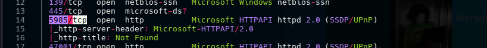

Procedemos a comprobar conectividad con `winrm` bajo las credenciales previamente obtenidas e indicando la ejecucion del comando *`pwd`*.
```bash
netexec winrm 10.10.2.5 -u XEROSEC -p 'GPP2k26blahblah' -x pwd
```

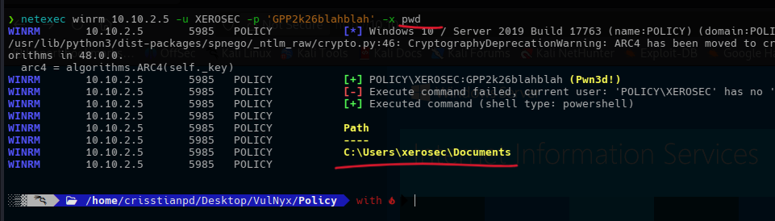

La conectividad es exitosa por lo que podemos usar la herramienta `evil-winrm` para obtener una shell que nos permite la ejecucion de comandos de una forma mas comoda.
```bash
evil-winrm -i 10.10.2.5 -u xerosec -p 'GPP2k26blahblah'
```

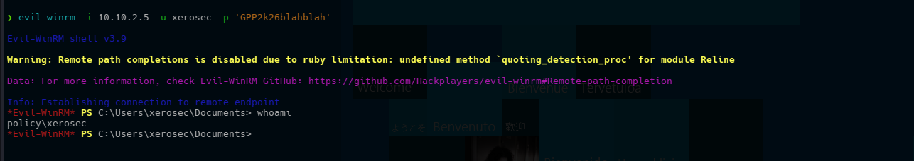

## Escalada de Privilegios

Despues de enumerar un poco el sistema, procedo a revisar las variables de entorno.
```powershell
Get-ChildItem Env:
```

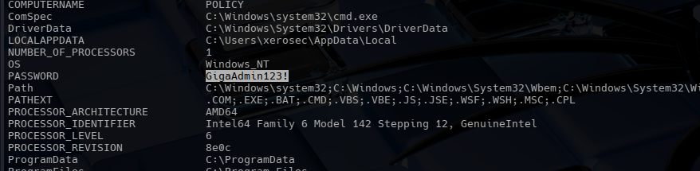

Existe una variable de nombre *`PASSWORD`* que almacena una credencial que lo mas probable es que sea para el usuario `administrator` ya que es el unico usuario que hay depues de nuestro usuario actual (*XEROSEC*).

Procedemos a intentar utilizar la contraseña obtenida con el usuario `administrator`
```bash
evil-winrm -i 10.10.2.5 -u administrator -p 'GigaAdmin123!'
```

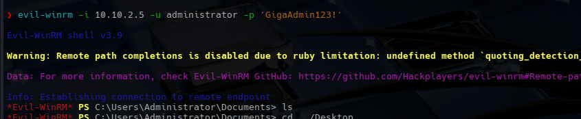

...

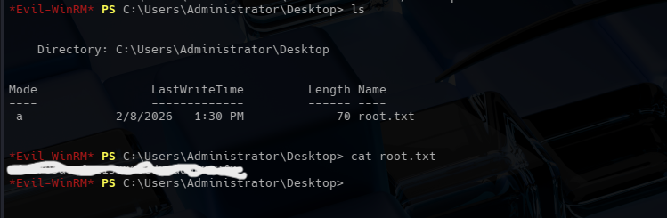

Ahora ya somos administradores del sistema.
<<<<<<< HEAD

Pwned!
=======
Pwned!
>>>>>>> 16892dcaf7499daf7e99166798663581f3191049
